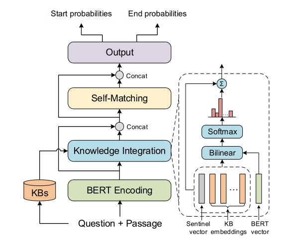

* content
{:toc}

###  KT-NET

In this work, we investigate the potential of leveraging external knowledge bases (KBs) to further improve BERT for MRC. We introduceKT-NET, which employs an attention mechanism to adaptively select desired knowledge from KBs, and then fuses selected knowledge with BERT to enable context- and knowledge aware predictions.
### knowledge
WordNet and NELL
### Method 
#### Retrieve Knowledge
> Given passage  P and question Q, we retrieve for each token w ∈ P ∪ Q a set of potentially relevant KB concepts C(w), where each concept c ∈ C(w) is associated with a learned vector embedding c.  we adopt knowledge graph embedding techniques and learn vector representations of KB concepts.  

### Major Components of KT-NET
> (1) BERT Encoding layer;(2) knowledge integration  layer (3)self-matching layer (4) output layer  

#### knowledge integration  layer

> The BERT representations is denoted as $h_i^L$ , enriches $h_i^L$  with relevant KB embeddings, which makes the representations not only context-aware but also knowledge-aware.  
> for each token $s_i$ we get its BERT representation $h_i^L \ni R^{d_1}$ and retrieve a set of potentially relevant KB concepts $C(s_i)$, each concept $c_j$ is associated with KB embeddings $c_i \ni R^{d_2}$, Then we employ an attention mechanism to adaptively select the most relevant KB concepts.   
> $\alpha_{ij} \propto exp(c_j^T W h_i^L)$  
> we further introduce a knowledge sentinel $\tilde c \ni R^d2$, and calculate its attention weight as:$ \beta_i \propto exp(\tilde c^T W h_i^L)$  
> $k_i = \sum_j \alpha_{ij} c_j + \beta_i \tilde c$ , where $\sum_j \alpha_{ij} + \beta_i = 1$  
> we concatenate the $k_i $ with the BERT representations $h_i^L$  and output $u_i=[h_i^L;k_i]$  

#### self-matching layer & output layer 
Please refer to the thesis "Enhancing Pre-Trained Language Representations with Rich Knowledge for Machine Reading Comprehension"

### Model Structure
  
