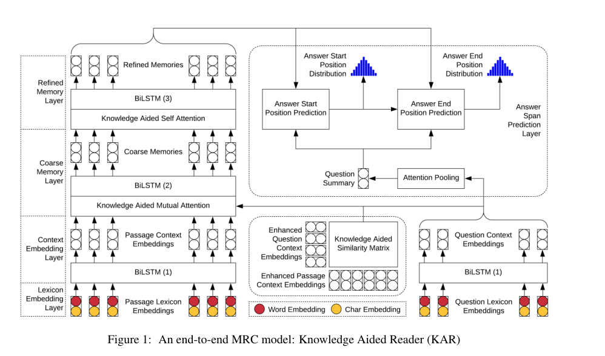

* content
{:toc}

### Motivation
模仿人类的阅读方式，利用通用性的知识作为背景阅读文本；
### Contribution
1. 提出使用Word-Net 抽取document-query 对的语义关系链作为知识  
2. 提出一种将知识和MRC模型进行融合的方式  

### Semantic Relation Chain  
1. WordNet  是按同义词集合组织的；论文把 WordNet(三元组形式存储）中具有链接关系的token 称为一个语义关系链;直接相连的token 称为1跳(1-hop);  

2. 论文定义了扩展同义词表：词w的扩展同义词表除了和它直接相连的词外也包含间接相连的词，理论上不限制跳数的情况下，扩展词表包含了词w在 WordNet的所有同义词;词W的扩展同义词表表示为 $ S_w^{*} $ , 同义词表（直接相连）表示为 $ S_w $  

3. 将词W所有的同义词都考虑是没有意义的，论文中设置K作为超参数限制W为中心的子图的大小（同义词构成），if k=0 $S_w^\times$ 那么词token1和词token2构成语义关系链的条件是：$S_{w1}^\times \cap S_{w2} !=\varnothing$ 

### General Knowledge Extraction
1. 对于passage-question对，其中的任意一个单词到passage 中任意单词的语义链接是需要抽取的通用性知识  
2. 对一个passage-question对中任意一个token,目标词集合都在passage中，方便处理只记录所有统一词在passage中的位置denoted as $E_w$  ；通过增加K的大小可以增加词的同义词集合的大小，实际上有用的同义词并不是很多，论文中通过交叉验证的方式确定K的大小   

### Knowledge Aided Reader

1. Context Embedding Layer. 使用BiGRU得到$C_p \in R^{d \times n}$ 和 $ C_q \in R^{d \times m}$  

2. Coarse Memory Layer.计算passage 和question之间的相似度，这里融合之前抽取的通用知识
$A_{ij} = f^\times (c_{p_i},c_{q_i})$  
$f^\times (c_{p_i},c_{q_i})=v_f^T[c_{p_i}^ \times;c_{q_j}^ \times;c_{p_i}^ \times \odot c_{q_i}^ \times]$   

$c_x^\times $ 表示融合知识后的表示（x=p,q);对于任意一个在passage 和question的token $c_w$,已知其在passage中对应的同义词位置为$E_w$,通过索引得到对应的token $c_w$的同义词表示$Z  \in R^{d \times |E_w|}$  
$t_i =v_c^Ttanh(W_c z_i + U_c c_w) \in R$  
$Cw^+ = \sum Z softmax({t1,...,t_{|E_w|}}) \in R^d$  
$c_w^\times =Relu(Dense(c_w^+)) \in R^d$  
$R_Q=C_Q softmax_r^T(A) \in R^{d\times n}$  
$R_P=C_p softmax_c(A) softmax_r^T(A) \in R^{d \times n}$  
$G=Relu(Dense([C_p,R_Q,C_p \odot R_Q;R_p \odot R_Q])) \in R^{d \times n}$  

这里公式比较多，类似BIDAF，首先计算相似矩阵，后使用双向的attention机制将question信息融合到passage中，不明白的可以参考BIDAF   

### Knowledge Aided Self Attention
采用类似之前的方式进行知识融合，融合的基础vector是$G \in R^{d*n}$  得到最终的表示H预测起始位置  

