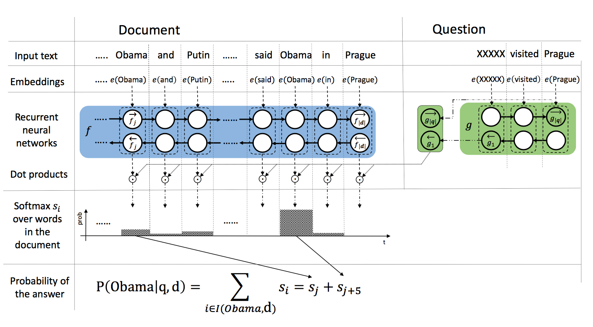

* content
{:toc}
### 数据集
> CNN&Daily Mail,完形填空式的机器阅读理解数据集，从美国有线新闻网（CNN）和每日邮报网抽取近一百万篇文章，每篇文章作为一个文档（document）,在文档的summary中剔除一个实体类单词作为问题(question)，剔除的单词作为答案(answer)。具体的参考论文<<CNN&Dailymail：Teaching Machines to Read and Comprehend>>  

### 模型
* #### Task Description

> the training data consist of tuples(q,d,a,A),where q is quesiton,d is document that containts the answer to question q,A is a set of possible answers and $a \in A$ is the ground truth answer.We assume that all possible answers are words from vocabulary,$A \subset V$,and the ground truth answer a appers in document,$a \in d$.  

* #### ASReader Model
>   
> 1. The thesis compute a vector embedding of each individual word in the context of the whole document,and compute a vector embedding of the query.  
> 2. Using Bi-GRU as encoder function.The first encoder encodes every word from the document d in the context of the whole document.The second encoder functon  translates the query q into the fixed length representation of the same dimensionality as evary word in the context.  
> 3. Using a dot product between the question embedding and the contextual embedding of each occurrence of a candidate answer in the document.  

4. The probability that the word w in the context of the whole document is a correct answer as: $ p(w \mid q,d) =\sum_{i \in I(w,d)}s_i $, $ s_i=exp(d_i * q) $. 

### 链接
[论文](https://www.aclweb.org/anthology/P16-1086.pdf)  
[源码](https://github.com/rkadlec/asreader)  