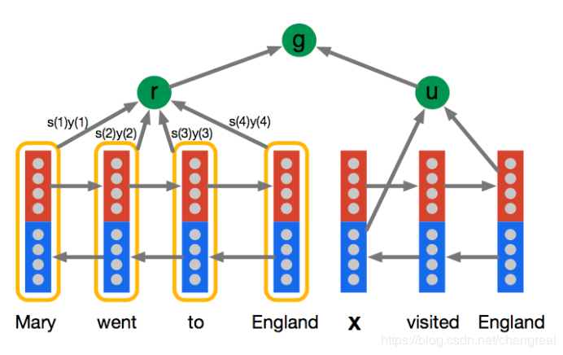

* content
{:toc}

### 数据集
> CNN&Daily Mail dataset,完形填空形式的阅读理解数据集，具体的参看论文<<CNN&Dailymail：Teaching Machines to Read and Comprehend>>  

### Attentive Reader
> Stanford Attentive Reader 模型是对 Attentive Reader模型的改进，首先介绍Attentive Reader  

* #### Attentive Reader
>   
> The thesis denote the outputs of the forword and backword LSTMs as $ y_t^{\rightarrow} $ and $ y_t^{ \leftarrow}$,the encoding u of the query  of the length |q| is formed by the concatenation of the final forward and backword ouputs,$u=y_q^{\rightarrow} || y_q^{\leftarrow}$. For the document the composite output for each token at position t is $y_d(t)=y_d^{\rightarrow} || y_d^{\leftarrow}$.The representation r of the document d is formed by a weighted sum of these ouput vectors.
> These weights are interpreted as the degree to which the network attends to the particular token in the document when answering the query:
$$
m(t)=tanh(W_{ym}y_d(t) + W_{um}u)
$$
$$
s(t)=\frac{exp(w_{ms}^Tm(t))}{\sum_{t=0}^{t=|d|}w_{ms}^Tm(t)}
$$
$$
r=y_ds
$$
>the variable s(t) is the normalised attention at token t.Given the attention score the embedding   of the document r is computed as the weighted sum of the token embeddings.
>
