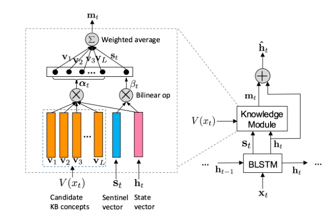

* content
{:toc}

###  Thesis
Leveraging Knowledge Bases in LSTMs for Improving Machine Reading

### Motivation
Traditional Method that exploit knowledge from KBs encode knowledge as discrete indicator features.  Not only do these features generalize poorly, but they require task-specific feature engineering to achieve good performance. KBLSTM , a novel method that leverage continuous representations of kBs to enhance the performance the learning of recurrent neural networks for machine reading.  

### Method 

> KBLSTM, an extension to bidirectional lstms. Concretely:   
> step1: learning embeddings of concepts in KBs using a knowledge graph embedding method.  
> step2: then retrieves the embeddings of candidate concepts that are related to the current word.  
> step3: integrates the candidate concepts into a state vector.

### Structure 

> compute an attention weight $\alpha_{ti}$ for concept vector $v_i$ via a bilinear operator 
> $\alpha_{ti} \propto exp(v_i^T W_v h_t)$  
> we introduce a knowledge sentinel that records the information of the current context and
use a mixture model to allow for better tradeoff between the impact of background knowledge and information from the context: 

$b_t=\sigma(W_b h_{t-1} + U_b X_t)$  

$s_t=b_t \odot tanh(c_t)$  

> The weight on the local context is computed as:$\beta \propto exp(s_t^T W_s h_t)$  
> the mixture model is defined as :$m_t = \sum_{i \ni V(s_t)} \alpha_{ti} v_i + \beta_t s_t$ , where $ \sum_{i \ni V(s_t)} \alpha_{ti} + \beta_t$ =1   
> The final knowledge-aware state vector $ \tilde h_t$ is computed as :$ h_t= h_t + m_t$  

