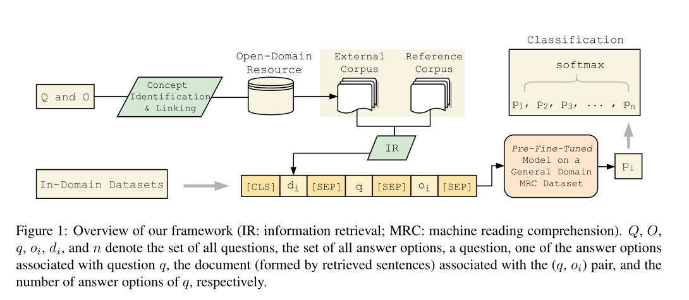

* content
{:toc}

### 论文
Improving Question Answering with External Knowledge

### 动机 &  贡献
论文主要面向多选形式的MRC任务
> 1. 使用外部的文本知识提高MRC性能
> 2. 使用额外数据提高MRC性能

### 模型结构

 from question and options extract concepts , then link these concepts to open-domain resource. 论文中只考虑名词  

对于每一个question-option pair中的concept 从开放语料中抽取包含对应concept  的句子，使用预训练的语言模型比如BERT、GPT等作为Baseline.