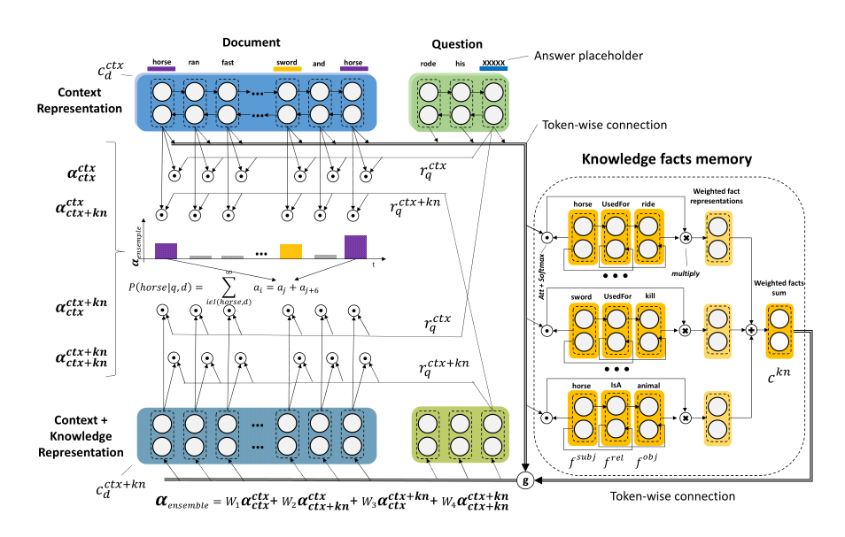

* content
{:toc}

### Motivation
论文结合外部知识和上下文信息推理答案，拟补以往主要依赖document-question 交互信息的不足；论文主要是基于ASReader 的改进  

### Knowledge Retrieval
使用的知识库主要是ConceptNet  

1. 从Document , Question ,Answer candidates 中检索包含在KB中的词，根据出现的位置不同赋予不同的权重：出现在A中，赋予权重4，出现在Q中赋予权重3，出现在D中的赋予权重2；一个三元组的权重值为subject和object 权重和，然后按照权重值对fact排序；对每一个(D,Q,A)限制抽取的三元组数量(论文中把这里的三元组知识叫fact)；  

2. 假设（j>i),如果同一个fact同时包含在候选答案$a_i$ 和$a_j$中，那么只把fact 作为$a_i$的参考知识；

3. 如果多个fact 有相同的权重值，按照出现的顺序使用（论文中对facts按tf-idf排序，发现性能并没有提升)   

   
### Neural Model

1.  Context Representations. 使用BiGRU得到$C_d^{ctx}$ 和$C_q^{ctx}$

2. 对Question: 只使用 placeholder(从文中抽取的句子，去掉某个词后作为问题，大部分是名词)所在位置的表示最终的$C_q \ni R^{2h}$ ,h is the hidden size，ASReader模型使用的是BIGRU的last hidden state;

3.  预测答案（对候选答案进行排序): 
$P(a_i|q,d)=softmax(\sum{\alpha_{i_j}})$  
$\alpha_{i_j}=Att(C_q^{ctx},C_{d_j}^{ctx}), i \ni [1,...,L]$  

$j$表示候选答案在文中的位置(由于数据集构造的原因，所有的候选答案都文中的词)，这里是将所有出现候选答案位置的权重值加权求和了；{i}是第i个候选答案  

4. 以上过程没有使用外部知识，如何加入外部知识，首先对知识编码，为了保持三元组的有序性，使用一下编码方式  

$f_{last}^{subj}=BiGRU(Emb(W_subj))$  
$f_{last}^{rel}=BiGRU(Emb(W_{rel}),f_{last}^{subj})$  
$f_{last}^{obj}=BiGRU(Emb(W_{obj}),f_{last}^{rel})$  

5. 对每一个token的facts使用加权求和的方式得到对应的representation;为了方便将facts构造为key-value 对；$M_i^{key}=f_{last}^{obj} or f_{last}^{subj}$ ; $M_i^{value}=f_{last}^{obj}$ (key是obj或者subj原因是D、Q和KB的公共词可能是subj或者是obj)

6. For each context-encoded token $c^{ctx}_{s_i}$ (s = d, q;i the token index) 融合知识的方式为：
$c_{s_i}^{kn}=\sum softmax(Att(c_{s_i}^{ctx},M_{1...p}^{key}))^T M_{1...p}^{value}$  
$c_{si}^{ctx+kn}=\gamma C_{s_i}^{ctx} + (1- \gamma) C_{s_i}^{kn}$  

得到$D^{ctx+kn}$ 和$Q^{ctx+kn}$; 然后对候选答案排序  
$P(\alpha_i|q,d) = softmax(\sum \alpha_{i_j}^{ensemble}) $  
$\alpha_{i_j}^{ensemble}=W_1 Att(C_q^{ctx},C_{d_j}^{ctx}) + W_2 Att(C_q^{ctx},C_{d_j}^{ctx+kn}) + W_3 Att(C_q^{ctx+kn},C_{d_j}^{ctx}) + W_4 Att(C_q^{ctx+kn},C_{d_j}^{ctx+kn})$  

