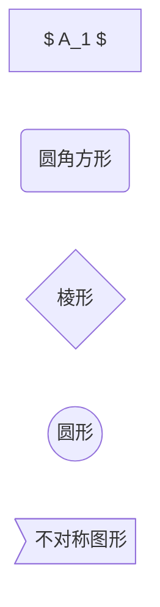

* content
{:toc}


### 作图
#### 基本形状
指定流程图的方向
LR，RL，TB、BT

#### 箭头  
```mermaid
graph LR
A1[A] --> B1[B]
A2[A] --- B2[B]
A3[A] -.- B3[B]
A4[A] -.-> B4[B]
A5[A] ==> B5[B]
A6[A] -- 注释 --> B6[B]
A7[A] -- 注释 -- B7[B]
```

