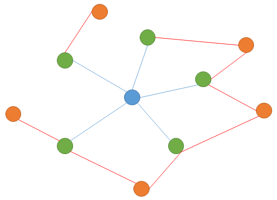

* content
{:toc}

### Motivation
之前的方法通常使用序列模型获取知识表示，不能获取到知识的结构化信息，论文提出了一个SKG(Structural Knowledge Graph-aware Network)模型。  
> 构建的子图包含context和 external knowledge nodes，保留了图结构信息   
> 动态的更新图节点的表示  

### Contributions
首先基于context和外部知识构建子图，使用知识表示的方法初始化知识的表示；
> 提出了一个简单的从知识图谱构建子图的方法  
> 使用Graph attention Network 动态的更新知识的表示  

### SKG Model
  

* #### Question and Paragraph Modeling
> 输入 [CLS] question [SEP] paragraph [SEP]   
> The final hidden output from BERT for the i th input token is denoted as$t_{bi}= \in R^H$,H is hidden size   

* #### Knowledge Sub-Graph Construction
> We first use knowledge graph embedding approach to generate the initial representation of nodes and edges in terms of the whole knowledge graph.  
> We consider a knowledge triple in a knowledge graph as (head,relation,tail). For the $i^{th}$ token $t_i$ in paragraph,we retrieve all triples whose head or tail contains lemmas of the token.  
> Take token "shortage" as example,we retrieve a triple like “(shortage, related to, lack)” one of  all triples whose head or tail contain the token "shortage". Then retrieve the neighbor triple of them,and reserve ones that contain lemmas of any token of the question.  
> We reorganize these triples into a sub-graph via connecting identical entities and reserving the relations as edges in these triples.
  

* #### Graph Attention
> For the $i^{th} $ token $t_i$ in the paragraph,its sub-graph is $g_i=\{n_1.n_2,n_3,...,n_k\}$,k is the number of the node,and $N_j$ is the set of the $i^{th}$ node neighbors .  
> The representaions of the nodes is updated L times  
> At the $L^{th}$ update,the updating rules are designed to model interaction between the $j^{th}$ node and its neighbor nodes.
$h_j^{l+1}=\sum_{n=1}^{N_j}\alpha_nt_n^l $   
$\alpha_n=\frac{exp\beta_n}{\sum_{j=1}^{N_j}exp(\beta_j)}$  
$\beta_n=(W_r^lr_n^l)^Ttanh(W_h^lh_n^l + W_t^lt_n^l)$  
>where $h_j^l in R^d$ is hidden state of the $j{th}$ node,and its neighbor's hidden state is $t_n^l$  
>After l updates ,we can get the final hidden state of the central node as the final representation,which can be denoted as $t_{k_i}$  

### Output Layer
> We combine this knowledge representation $t_{k_i}$ ,with the textual representation $t_{b_i}$ via sigmoid gate   
> $ w_i = \sigma (W[t_{b_i};t_{k_i}]) $  
> $ \bar t_i=w_i \bigodot  t_{b_i} + (1 - w_i) \bigodot  \bar t_{k_i} $  we denote $ T=\{ \bar t_1,\bar t_2,...,\bar t_n\}$ as the final representation.  
> We study a start vector $ S \in R^H $ and an end vector $ E \in R^H $.Then the probability of the  $ i^{th} $ token being the start of the answer span is computed as a dot product between $T_i$ and S followed by a softmax over all of the words in the paragraph:
$P_i^s=\frac{e^{S \cdot T_i}}{\sum_j{e^{S \cdot T_j}}}$ and $P_i^e$ can be calculated by the same above formula.  