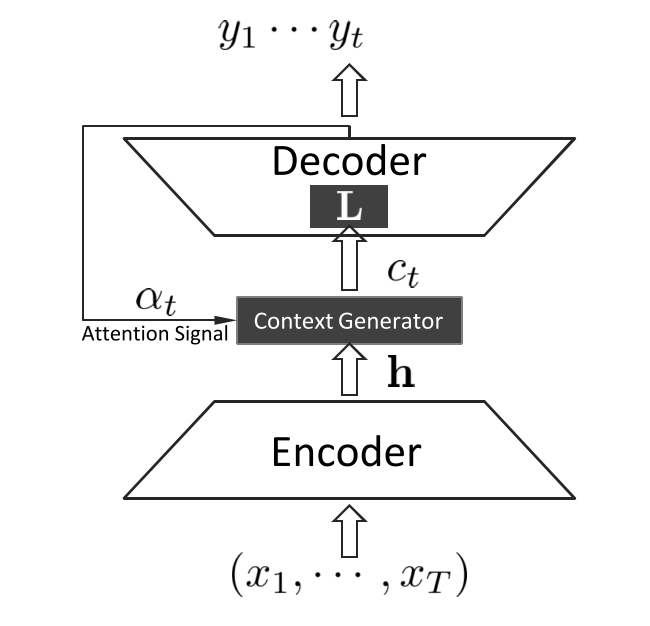
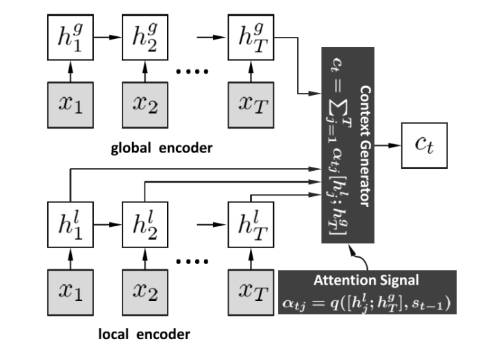

* content
{:toc}

###  Model

### Retrieval-based Method
> 1. the responses are pre-existed and hard to be customized for the particular text or requirement from the task  
> the use of matching features alone is usually not sufficient for distinguishing positive responses from negative ones  

### NMT
>1. the responsesare not semantically equivalent to the posts as in translation.
### Context Generator
>  1. using the last hidden state of RNN  
>  2. using the soft attention mechanism. at time t: compute context representation between $s_t$ and $H={h_1,h_2,...,h_t}$  
>  3. combine the above two methods

