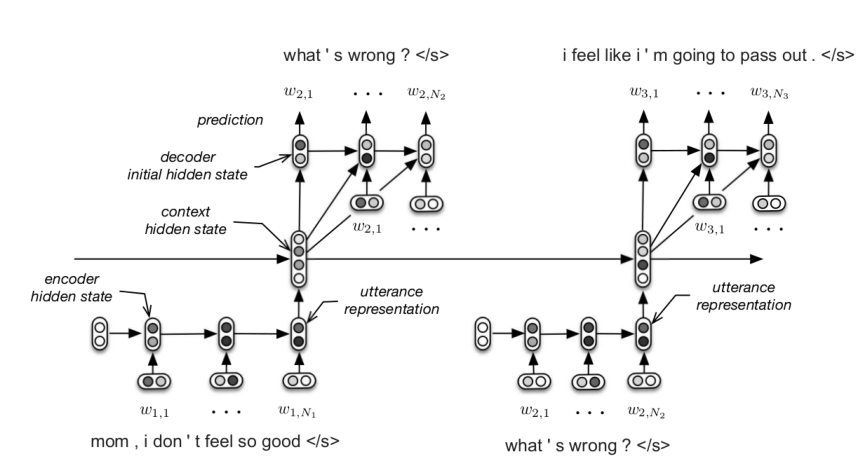

* content
{:toc}

###  Motivation

会话的过程可以被认为是：utterrance dependency and token-level dependency

$$
P_\theta\{U_1,U_2,...,U_m\}=\prod_{m=1}^{M} P(U_m | U_{<m})
							=\prod_{m=1}^{M} \prod_{n=1}^{N_m} P_\theta(W_{m,n}|W_{m,<n},U_{<m})
$$

先前的工作将会话看作是马尔科夫链的决策过程，但是需要人工特征，甚至需要人参与，工作量大、耗时

本文使用层级的RNN，从utterance-level 和token-level 级别建模utterance 之间的复杂依赖关系（utterance-level on time and token -level on time)

### Datasets
本文使用的数据集只有两种角色，3个utterances

### Model Structure

