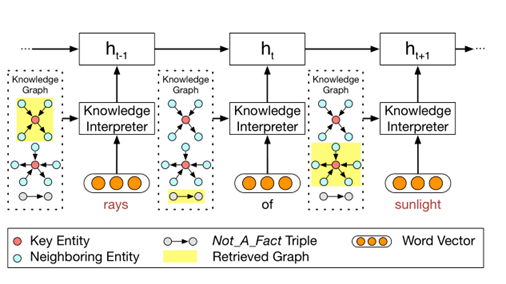
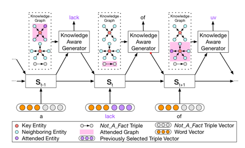

* content
{:toc}

###  Motivation
在开放领域、开放话题的对话生成中，已有的使用常识知识的模型存在两个关键问题：1. 受限于小规模的知识或者特定领域的知识  2. 没有考虑三元知识的整体性。

### Idea
使用大规模常识知识促进post的理解，同时利用知识帮助回复的生成。
###  OverView

> 1. 模型基于seq2seq 结构
> 2. encode 阶段使用static graph attention 促进post 的理解
> 3. decode 阶段使用dynamic graph attention 帮助生成

### Model

> 1. Given post $X$ ,  commonsense knowledge graphs $G=\{g_1,g_2,...,g_{N_g}\}$ , the goal is to genenrate a proper response $Y=\{y_1,y_2,..,y_n\}$   

$$
P(y|X,G)=\prod_{t=1}^{m} P(y_t|y_{<t},G)
$$

> 2. The graphs are retrieved from a knowledge base using the words in a post as queries. $g_i=\{ \tau_1,\tau_2,...,\tau_{n_{g_i}}\}$, $\tau_i=\{h,r,t\}$  
> 3. iIn this thesis,  we adopt TransE to represent the entities and relations in the knowledge base. $k=(\textbf{h,r,t})=MLP(TransE(h,r,t))$, where the $\textbf{h,r,t}$ are the transformed TransE embeddings for /h/r/t respectively  

#### Static Graph Attention

> 1. The knowledge interpreter uses each word $x_t$ in a post as the key entity to retrieve a graph $g_i=\{\tau_1,\tau_2,...,\tau_{n_{G_i}}\}$ from the entire commonsense knowledge base.  For common words which match no entity  in commonsense knowledge graph, a knowledge graph that contains a special symbol Not A Fact (the grey dots) is used. $e(x_t)=[w(x_t);g_i]$  
$$
g_i=\sum_{n=1}^{N_{G_i}} \alpha_n^s[h_n;t_n] \\
\alpha_n^s=\frac{exp(\beta_n^s)}{\sum_{j=1}^{N_{g_i}}exp(\beta_j^s)} \\
   \beta_n^s=(W_rr_n)^T tanh(W_h h_n + W_t t_n)
$$

>2.      a graph vector $g_i$ is a weighted  sum  of  the head and tail  vectors $[h_n;t_n]$ of the triples contained  in the graph.  

#### Dynamic Graph Attention (Knowledge Aware Generator)

> 1. The knowledge aware generator is designed to generate a response through making full use of the retrieved knowledge graphs  

$$
s_{t+1}=GRU(s_t,|c_t;c_t^g;c_t^k,e(y_t)) \\
e(y_t)=[w(y_t);k_j]
$$
> 2. where $c_t$ is the context vector, $c_t^g,c_t^k$ are context vectors attended on knowledge graph vectors.  $c_t^g$ is based on the graph vectors $g$ and the $c_t^K$ is based on the triples of all subgraphg $g$. 

$$
c_t^k=\sum_{i=1}^{N_{G}}\sum_{j=1}^{N_{g_i}}\alpha_{ti}^g \alpha_{tj}^k k_j \\
\alpha_{tj}^k=\frac{exp(\beta_{tj}^{k})}{\sum_{n=1}^{N_{g_i}}exp(\beta_{tn}^k)} \\
\beta_{tj}^k=k_j^T W_c s_t
$$

$$
c_t^g=....(参看论文)
$$

### Output

$$
a_t=[s_t;c_t;c_t^g;c_t^k] \\
\gamma_t=sigmod(V_o^T a_t)	\\
P_c(y_t=w_c)=softmax(W_o^T a_t) \\
P_e(y_t=w_e)=\alpha_{ti}^g \alpha_{t_j}^k \\
P(y_t)=\begin{bmatrix} 
(1-\gamma_t) Pc \\
\gamma_t Pe
\end{bmatrix}
$$

