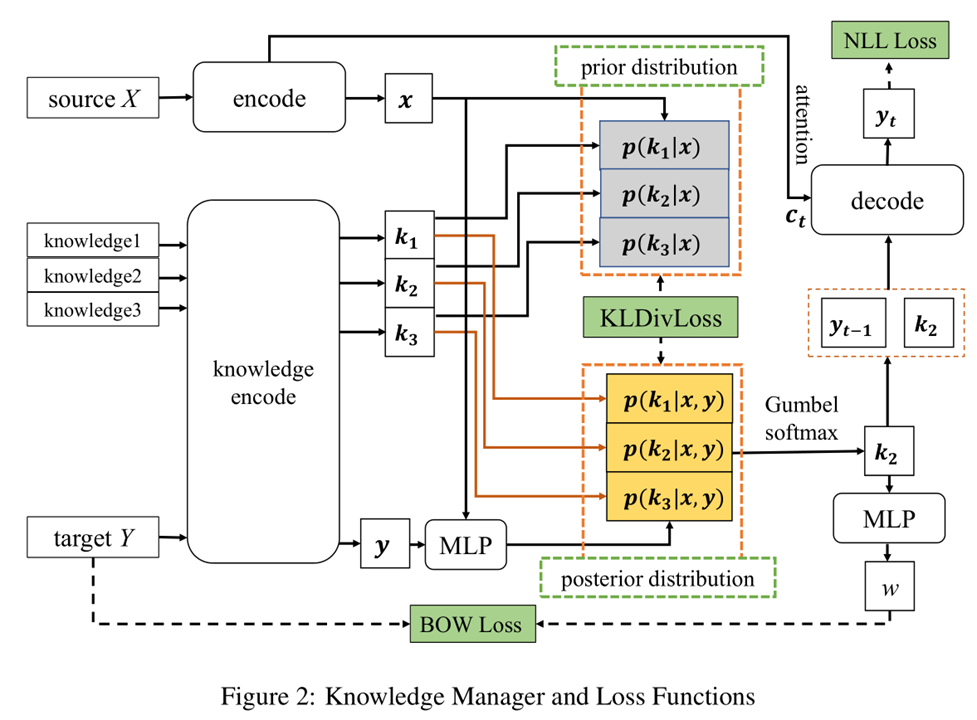

* content
{:toc}

###  Motivation
以往的有了很多利用外部知识的工作，但是很少有工作表明出在对话生成的过程中整合知识的的有效性。本文利用后验知识分布指导知识的选择，生成语义更加丰富和合适的回复。

#### Question
以往在对话使用外部知识的工作虽然取得效果，但是缺乏有效的机制保证选择知识的正确性。而且大部分只关注知识和历史信息和知识的语义相似性。
### Idea
 本文同时考虑历史信息和response 信息来指导知识的选择。使用后验知识分布指导知识的选择
### Model

> 1. 给定对话历史和就选知识，使用 Encoder 对历史信息$x$和knowledge$ K$进行编码。训练阶段：正确的response 可以使用，同时对response 进行编码。  

$$
P(k_i|x,y)=\frac{exp(k_i MLP([x;y])) }{\sum_j^n(exp(k_j MLP([x,y])))}
$$

> 2. 根据$P(x,y)$计算知识的概率分布  
> 3. MLP is  a fully connected layer, $P(k_i\|x,y)$, is posterior knowledge distribution   
> 4. 在测试阶段，$y $ 是不可用的，本文使用知识的先验概率分布$p(k_i \|x)$模拟后验分布   
> 5. 文中加入了BOW损失，保证选择的知识和目标response的相关性  

$$
p_{\theta}(y_t|k_i)=\frac{exp(e_{y_t})}{\sum_{v \in V} exp(w_v)}
$$

